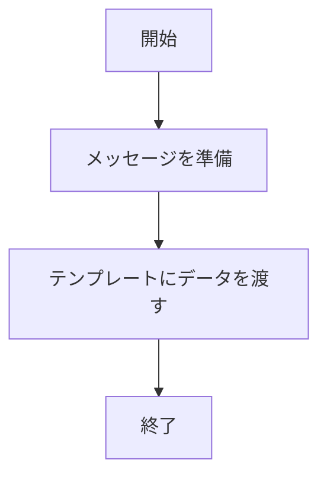
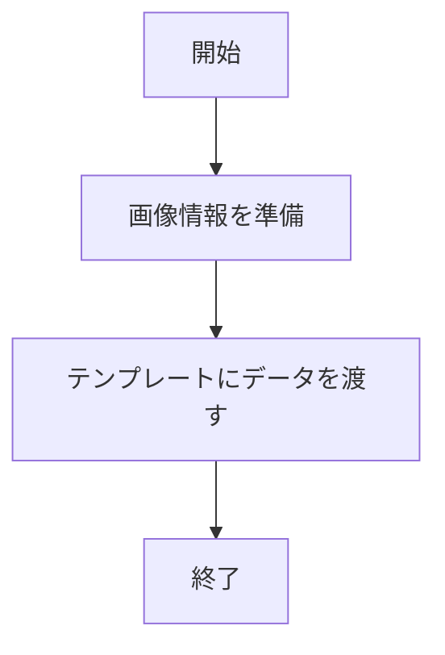
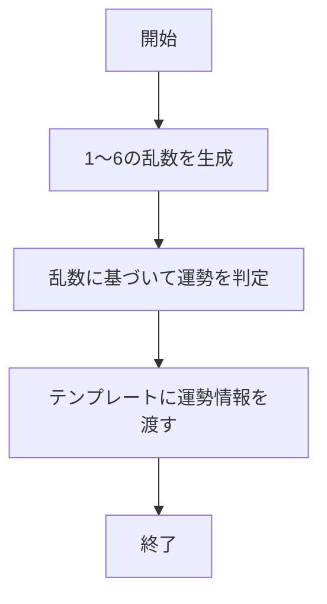
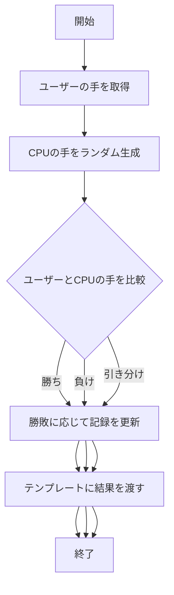
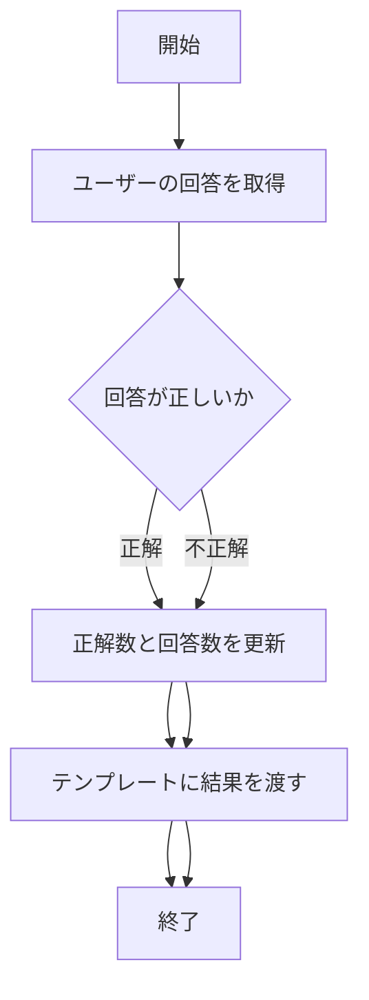
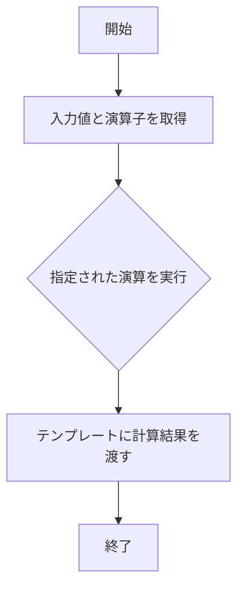

# webpro_06


## ファイル一覧
ファイル名 | 説明
-|-
app5.js | プログラム本体
views/show.ejs | 挨拶画面
views/icon.ejs | appleのロゴ
views/luck.ejs | 占いの開始画面 
views/janken.ejs | じゃんけんの開始画面
views/quiz.ejs | クイズの開始画面
views/calculator.ejs | 電卓の開始画面

```javascript
console.log( 'Hello' );
```

## 1./hello1
・関数名：app.get("/hello1", callback)
・機能："Hello world" と "Bon jour" という2つのメッセージを含むページを表示する。
・入力：GETリクエスト（URL: /hello1）
・出力： show.ejs テンプレートを用いて"Hello world" と "Bon jour" を含むHTMLを表示
・引数：req（クライアントからのリクエストオブジェクト）、res （サーバーからのレスポンスオブジェクト）
・返り値：なし

手順
1. app5.js を起動する。
2. ブラウザで http://localhost:8080/hello1 にアクセスする。

## 2./hello2
・関数名：app.get("/hello2", callback)
・機能："Hello world" と "Bon jour" を固定値としてページに表示する。
・入力：GETリクエスト（URL: /hello2）
・出力： show.ejs テンプレートを用いて"Hello world" と "Bon jour" を含むHTMLを表示
・引数：req（クライアントからのリクエストオブジェクト）、res（サーバーからのレスポンスオブジェクト）
・返り値：なし

手順
1. app5.js を起動する。
2. ブラウザで http://localhost:8080/hello2 にアクセスする。

[hello1とhello2のフローチャート]



## 3./icon
・関数名：app.get("/icon", callback)
・機能：Appleのロゴを表示するページを提供する。
・入力：GETリクエスト（URL:/icon）
・出力：icon.ejs テンプレートを用いてAppleロゴを含むHTMLを表示 
・引数：req（クライアントからのリクエストオブジェクト）、res （サーバーからのレスポンスオブジェクト）
・返り値：なし

手順
1. app5.js を起動する。
2. ブラウザで http://localhost:8080/icon にアクセスする。



## 4./luck
・関数名：app.get("/luck", callback)
・機能：ランダムな運勢を生成して表示する
・入力：GETリクエスト（URL:/luck）
・出力：luck.ejs テンプレートを用いてランダムに生成された運勢を含むHTMLを表示（1~6のランダムな値に基づき表示される）
・引数：req（クライアントからのリクエストオブジェクト）、res （サーバーからのレスポンスオブジェクト）
・返り値：なし

手順
1. app5.js を起動する。
2. ブラウザで http://localhost:8080/luck にアクセスする。


## 5./janken
・関数名：app.get("/janken", callback)
・機能：ユーザーの手とサーバー側でランダムに選択された手を比較し、勝敗を判定する。
・入力：GETリクエスト（URL:/janken?hand={グー|チョキ|パー}&win={勝ち数}&total={対戦数}）
パラメータ | 説明
-|-
hand | ユーザーの選んだ手（例: "グー", "チョキ", "パー"）
win | ユーザーの勝利数
total | ユーザーの対戦回数

・出力：janken.ejs テンプレートを用いて以下のデータを表示
データ | 説明
-|-
your | ユーザーの選んだ手
cpu | サーバーの選んだ手
judgement | 勝敗結果（"勝ち", "負け", "引き分け"）
win | 更新された勝利数
total | 更新された対戦回数

・引数：req（クライアントからのリクエストオブジェクト）
→req.query.hand、req.query.win、req.query.total
res （サーバーからのレスポンスオブジェクト）
・返り値：なし

手順
1. app5.js を起動する
2. Webブラウザでlocalhost:8080/jankenにアクセスする
3. 自分の手を入力して送信すると結果が表示される。



## 6./quiz
・関数名：app.get("/quiz", callback)
・機能：クイズを出題し、ユーザーの回答が正解かどうかを判定する。また、正解数と回答回数をカウントする。
・入力：GETリクエスト（URL:/quiz?answer={ユーザーの回答}&correct={正解数}&total={回答数}）
パラメータ | 説明
-|-
answer | ユーザーの回答（例: "エベレスト"）
correct | 正解数
total | 回答数

・出力：quiz.ejs テンプレートを用いて以下のデータを表示
データ | 説明
-|-
question | クイズの質問（例: "世界で一番高い山は？"）
choices | 選択肢（例: [富士山, キリマンジャロ, エベレスト]）
correctAnswer | 正しい答え（例: "エベレスト"）
userAnswer | ユーザーの回答
correct | 更新された正解数
total | 更新された回答回数
isCorrect | 正誤判定（true または false）

・引数：req（クライアントからのリクエストオブジェクト）
→req.query.answer、req.query.correct、req.query.total
res （サーバーからのレスポンスオブジェクト）
・返り値：なし

手順
1. app5.js を起動する。
2. ブラウザで http://localhost:8080/quiz にアクセスする。
3. answerに回答を入力
4. 結果が表示される


## 7./calculator
・関数名：app.get("/calculator", callback)
・機能：ユーザーが指定した2つの数値と演算子に基づいて計算を行い、結果を返す。
・入力：GETリクエスト（URL:/calculator?num1={数値1}&num2={数値2}&operator={演算子}）
パラメータ | 説明
-|-
num1 | 計算に使用する1つ目の数値（例: 10）
num2 | 計算に使用する2つ目の数値（例: 5）
operator | 使用する演算子（例: "+", "-", "*" または "/"）

・出力：calculator.ejs テンプレートを用いて以下のデータを表示
データ | 説明
-|-
num1 | 1つ目の数値
num2 | 2つ目の数値
operator | 使用した演算子
result | 計算結果

・引数：req（クライアントからのリクエストオブジェクト）
→req.query.num1、req.query.num2、req.query.operator
res （サーバーからのレスポンスオブジェクト）
・返り値：なし

手順
1. app5.js を起動する
2. Webブラウザでlocalhost:8080/public/calculatorにアクセスする
3. 2つの数値（num1とnum2）と演算子（+, -, *, /）を入力し、送信する。
4. 計算結果が画面に表示される。



## githubに追加したファイルをアップロードする

以下の三つのコマンドを実行する

コマンド | 役割
-|-
$ git add . | 現在のディレクトリ内のすべての変更されたファイル（新規作成・変更・削除されたもの）をステージングエリアに追加する。（ステージングエリアは、次回のコミットに含める準備をする場所。）
$ git commit -am 'コメント' | ステージングエリアに追加されている変更を「コミット」する。（コミット時にコメントを記述）
$ git push | ローカルのコミット履歴をリモートリポジトリに反映する。


